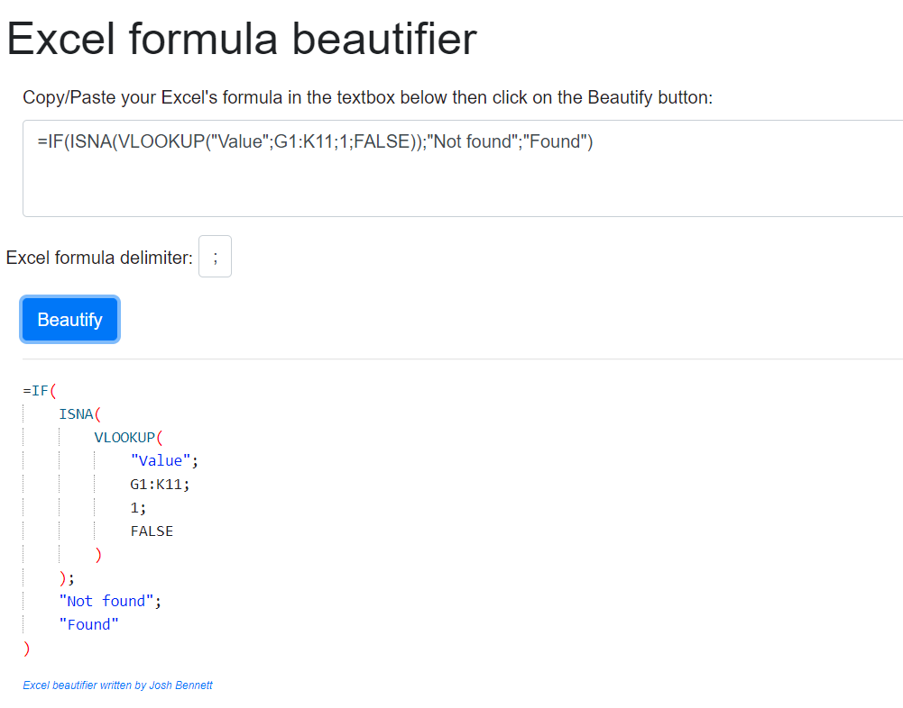

# Excel Formula Beautifier

Improves the readability of Excel formulas. Display long formula into a nice HTML output

Display

```
=IF(ISNA(VLOOKUP("Value";G1:K11;1;FALSE));"Not found";"Found")
```

as

```
=IF(
    ISNA(
        VLOOKUP(
            "Value";
            G1:K11;
            1;
            FALSE
        )
    );
    "Not found";
    "Found"
)
```

## How to use

Just copy/paste your Excel formula into the text box as illustrated here below and click on the `Beautify` button.

Parameter `Excel formula delimiter`: depending on your settings, the delimiter in Excel can be a comma `,` or a semi-colon `;`. If needed, update the delimiter.



## Source

The `excelFormulaUtilitiesJS` script has been written by `Josh Bennett` and available on GitHub: https://github.com/joshbtn/excelFormulaUtilitiesJS.
